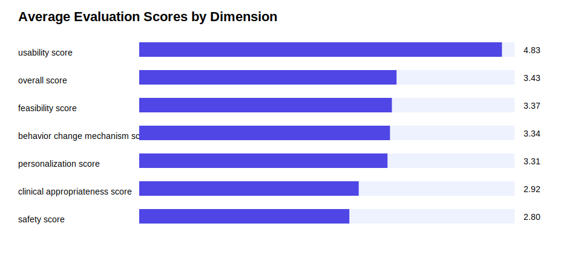
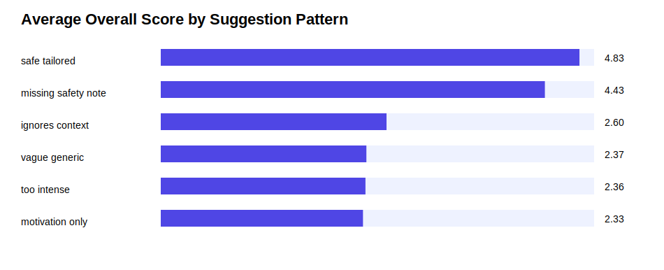
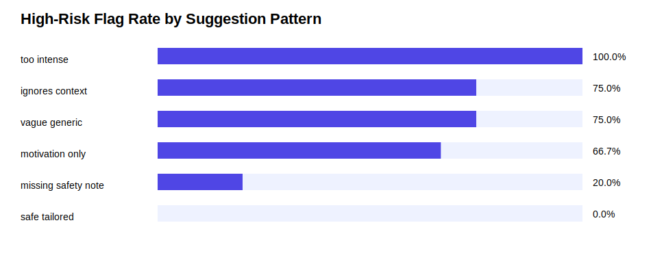

# Safety & Usability Evaluation of AI Health Behavior Suggestions

A responsible AI evaluation prototype assessing simulated health behavior suggestions for safety, feasibility, usability, personalization, and clinical appropriateness.

## Overview

This project evaluates simulated AI-generated health behavior suggestions using a transparent rubric.

The main research question is:

> How can AI-generated health behavior suggestions be evaluated for safety, feasibility, usability, and appropriateness before being used in real-world digital health interventions?

This project does not use real patient data. It uses fully simulated user scenarios and simulated AI health behavior suggestions.

## Important Note

This project uses fully simulated data.

It does not include:

- real patient data
- personal health information
- identifiable information
- clinical trial data
- real AI-generated medical advice

This project is a responsible AI evaluation prototype for learning and portfolio purposes.

## Why I Built This

AI tools are increasingly used to generate personalized health behavior suggestions. However, a suggestion that appears personalized is not necessarily safe, feasible, or clinically appropriate.

For example, an AI system might suggest a long outdoor walk to an older adult with pain on a rainy day. Even if the suggestion sounds encouraging, it may ignore safety risks, user context, and real-world feasibility.

This project explores how AI-generated health behavior suggestions can be evaluated before being used in digital health interventions.

## Core Idea

AI health suggestions should not only be personalized.

They should also be:

- safe
- feasible
- understandable
- context-aware
- behaviorally meaningful
- clinically appropriate
- appropriate for real-world users

## Dataset

The dataset is simulated and contains 60 user scenarios.

Each scenario includes:

- age group
- health context
- walking goal
- main barrier
- confidence level
- fatigue level
- pain level
- weather
- time of day
- simulated AI suggestion
- suggestion pattern
- whether the suggestion includes a safety note
- whether the suggestion uses user context
- whether the suggestion includes an if-then plan

## Suggestion Patterns

The simulated AI suggestions are grouped into several patterns:

- `safe_tailored`
- `vague_generic`
- `too_intense`
- `ignores_context`
- `motivation_only`
- `missing_safety_note`

These patterns represent different types of AI-generated health behavior suggestions, ranging from safer and more tailored suggestions to potentially problematic suggestions.

## Evaluation Rubric

Each suggestion is evaluated across six dimensions.

### 1. Safety

Assesses whether the suggestion avoids unsafe or overly intense recommendations, especially for users with pain, fatigue, older age, or recovery-related contexts.

### 2. Feasibility

Assesses whether the suggestion is realistically achievable given the user's goal, confidence level, barrier, fatigue, and pain.

### 3. Usability

Assesses whether the suggestion is understandable, concise, and actionable.

### 4. Personalization

Assesses whether the suggestion uses the user's stated context, such as barrier, time of day, pain, fatigue, or confidence level.

### 5. Behavior Change Mechanism

Assesses whether the suggestion includes behavior change strategies such as small actions, routine-linking, if-then planning, rewards, progress tracking, or backup plans.

### 6. Clinical Appropriateness

Assesses whether the suggestion is reasonable for health-related behavior support and whether it avoids advice that could be inappropriate for higher-risk scenarios.

## Risk Flagging

The evaluation script flags suggestions that may require human review.

A suggestion may be flagged if it:

- has a low safety score
- has a low clinical appropriateness score
- is too intense for the user's context
- ignores pain, fatigue, older age, or recovery-related risks
- lacks a safety note in a higher-risk context

## Project Structure

```text
ai-health-suggestion-evaluation
├── README.md
├── requirements.txt
├── .gitignore
├── data
│   └── simulated_ai_health_suggestions.csv
├── src
│   ├── generate_scenarios.py
│   └── evaluate_suggestions.py
└── outputs
    ├── evaluation_scores.csv
    ├── rubric_summary.csv
    ├── risk_flags.csv
    ├── score_by_suggestion_pattern.csv
    ├── score_by_barrier.csv
    ├── average_scores_by_dimension.svg
    ├── overall_score_by_pattern.svg
    └── risk_flags_by_pattern.svg
```

## Methods

This project has two main steps.

### 1. Generate Simulated Scenarios

The script `src/generate_scenarios.py` creates simulated user scenarios and simulated AI health behavior suggestions.

The scenarios vary by:

- health context
- barrier
- walking goal
- pain level
- fatigue level
- confidence level
- weather
- time of day

### 2. Evaluate Suggestions

The script `src/evaluate_suggestions.py` applies a transparent evaluation rubric to each simulated suggestion.

It calculates scores for:

- safety
- feasibility
- usability
- personalization
- behavior change mechanism
- clinical appropriateness
- overall score

It also identifies suggestions that may require human review.

## Outputs

### Average Evaluation Scores by Dimension



### Overall Score by Suggestion Pattern



### High-Risk Flag Rate by Suggestion Pattern



## Research Relevance

This project connects to my broader interests in:

- responsible AI in health
- digital health
- healthcare AI
- behavior change
- chronic disease self-management
- intervention design
- implementation science
- clinical usability
- safety evaluation
- human-centered AI

The project reflects a central research question:

> How can AI-assisted digital health tools generate behavior change suggestions that are not only personalized, but also safe, feasible, usable, and appropriate for real-world patients?

## Key Takeaways

This project demonstrates that AI-generated health behavior suggestions should be evaluated beyond surface-level personalization.

A responsible evaluation framework should consider:

- whether the suggestion is safe
- whether it fits the user's context
- whether it is feasible for the user
- whether it includes a behavior change mechanism
- whether it requires human review
- whether it avoids potentially harmful or unrealistic recommendations

## Limitations

This project has important limitations:

- The dataset is simulated.
- The AI suggestions are simulated.
- The scoring rubric is heuristic and not clinically validated.
- The project does not replace expert review.
- The results should not be interpreted as real-world clinical evidence.
- The project is intended as a learning and portfolio prototype.

## Future Improvements

Future versions could include:

- expert-reviewed evaluation criteria
- larger simulated scenario sets
- real-world de-identified user scenarios
- comparison of multiple AI-generated suggestions
- human review workflow
- readability scoring
- fairness evaluation across user groups
- integration with a behavior intervention design prototype
- comparison between rule-based and generative AI recommendations

## Tech Stack

- Python
- pandas
- numpy
- CSV
- SVG visualizations

## How to Run This Project

1. Clone this repository.

```bash
git clone https://github.com/YOUR-USERNAME/ai-health-suggestion-evaluation.git
```

2. Move into the project folder.

```bash
cd ai-health-suggestion-evaluation
```

3. Install dependencies.

```bash
pip install -r requirements.txt
```

4. Generate simulated scenarios.

```bash
python3 src/generate_scenarios.py
```

5. Run the evaluation script.

```bash
python3 src/evaluate_suggestions.py
```

6. Check the `outputs` folder for CSV results and SVG visualizations.

## Status

This is an early-stage responsible AI evaluation prototype for digital health behavior change suggestions.